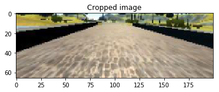

# CarND-Behaviour-Cloning

## Introduction
This is third project from the Udacity Nanodegree on Self-driving Car (CarND).
The purpose is to teach a (simulated) car to drive on an empty track and
maintain itself in the middle of the track.
A covolutional neural network is to be employed, taking in a photo from
the front camera of the car and outputing the desired steering angle.

My implementation follows closely this [nVidia paper](http://images.nvidia.com/content/tegra/automotive/images/2016/solutions/pdf/end-to-end-dl-using-px.pdf).

## Data collection, normalization and augmentation
### Data collection
A sample set of data was provided by Udacity, presumbly generated by having a human constroling
the simulated car driving around the track.
Additional data could be collected by similar method (simulated driving)
and could potentially improve the performance, but due to time constraint, I restrict
myself to the given set of `8036` samples, and make ise of data augmentation 
to generate additional data during training.

### Data normalization
The images, originally in RGB, were converted to YUV color space, and the three color 
channels were then recentered and rescaled to the min-max values of `-0.5` and `0.5`.

One third of the top and one fifth of the bottom of the each image were cropped away 
as they contained no relevant information about the position of the car or the tracks.

Lastly, the images were resized to 200x66 to reduce the dimensionality of the network.
200x66 was the input size chosen in the nVidia paper.

### Data spliting
As I employed an apdaptive optimizer for training (Adam), there were few hyper-parameters 
to tune. In fact, I left all the hyper-paramters at their default/typical values and did
no substatial tuning at all (except for the trail and error of different netword designs
and dimensionality). Thus, the data were only splitted into training set and test set, with
25% of the original data reversed for testing.

### Data augmentation
Additional data were generated using samples from the training sets with the following 
transformation: random horizontal flip, random brightness adjustment, random vertical
and horizontal translation, and the use of photos from the left and right cameras.

1. Flip: The image was flip horizontally and the sign of steering angle was reversed
2. Additional camera: randomly choose from the 3 available camera; if the left camera
was used, the steering angle would be adjusted up by `0.25`, and `-0.25` if the right
camera was used
3. Horizontal shift: to mimic small shift in the position of the car on the track;
the steering angle also need to be adjusted by adding `0.04` per pixel of translation
to the right and subtracting when shifting to the left.
4. Vertical shift: to mimic going up and down slopes
5. Brightness adjustment: to mimic different lighting conditions

This is an image from the orignal data set  

This is the same image after being cropped and resized

This is several images generated from the same image with random transformation

The dataset is rather unbalanced, with a large portion having steering of zeros (driving
straight).
Because of that, at the begining of the training, I will decrease the proportion of 
samples with small/zero steering angle in the training set to help the model learn
to drive in compliated situation (curve track). At later epoches, I will gradually
introduce those samples back to make sure the model also learn to drive straight
when needed.

## Neural network design
The design of the final model follow closely the implementation of the nVidia paper.
It includes 5 convolutional layers followed by 4 fully connected layers.
ReLU activation was used throughout.
I added 3 dropout layers as well as L2 regularization to all appropiate layers to prevent over-fitting.

              layer output size
     -------------- ------------------
         InputLayer (None, 66, 200, 3) 
             Lambda (None, 66, 200, 3) 
      Convolution2D (None, 31, 98, 24) 
               Relu (None, 31, 98, 24) 
      Convolution2D (None, 14, 47, 36) 
               Relu (None, 14, 47, 36) 
      Convolution2D (None, 5, 22, 48)  
            Dropout (None, 5, 22, 48)  
               Relu (None, 5, 22, 48)  
      Convolution2D (None, 3, 20, 64)  
               Relu (None, 3, 20, 64)  
      Convolution2D (None, 1, 18, 64)  
            Dropout (None, 1, 18, 64)  
               Relu (None, 1, 18, 64)  
            Flatten (None, 1152)       
              Dense (None, 1024)       
            Dropout (None, 1024)       
               Relu (None, 1024)       
              Dense (None, 128)        
               Relu (None, 128)        
              Dense (None, 64)         
               Relu (None, 64)         
              Dense (None, 16)         
               Relu (None, 16)         
              Dense (None, 1)    
              
## Training

The model was trained with Adam optimizer and batch size of 32. 
Data augmentation was used to generate 20000 samples per epoch.
The MSE during training is plotted in the figure above.
Probably due to data augmentation that increases input variance in
training set, the training mean square error was much higher than
the validation set. 
The final training took 10 epochs, as additional epochs did not seem
to improve performance.

